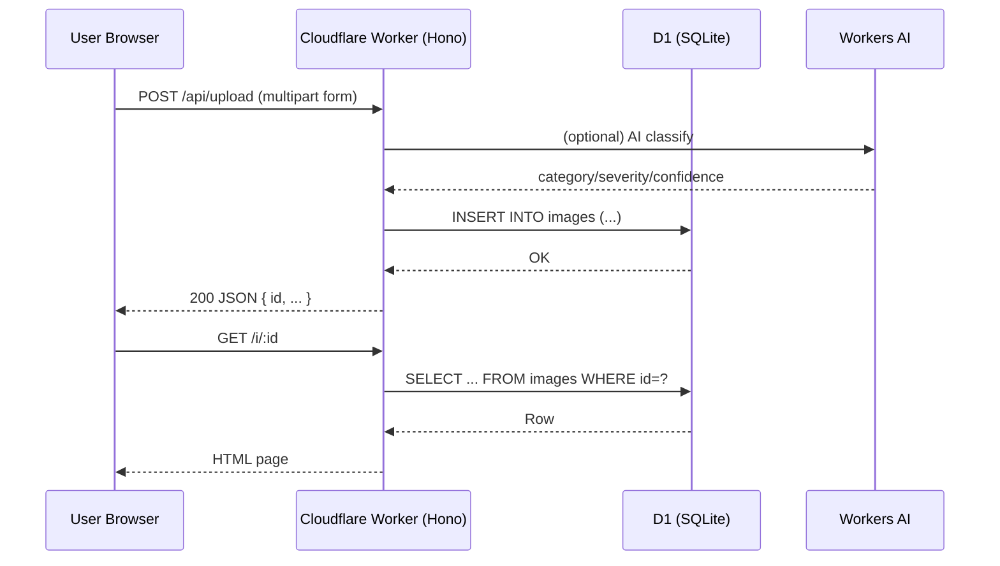

# Paru Project (Hackathon Starter)

This repo contains a **Cloudflare Workers** web app under the `city/` folder.
It’s designed to be **hackathon-friendly** and approachable for **first-year engineering students** learning:
- HTML + CSS
- JavaScript + HTTP APIs
- Databases (Cloudflare D1 / SQLite)
- Deploying to the cloud (Cloudflare Workers)

If you want the detailed app-specific docs, see:
- `city/README.md`

---

## What you are building (in simple words)

A typical web app has:
- **Frontend**: what runs in the browser (HTML/CSS/JS)
- **Backend**: code on the server (here: Cloudflare Worker)
- **Database**: where data is stored (here: Cloudflare D1 / SQLite)

In this repo, the backend and frontend are deployed together:
- The Worker serves API routes like `/api/upload`
- The Worker also serves static files from `city/public/` like `/user.html` and `/admin.html`

---

## Project diagram (architecture)

```text
+---------------------------+        HTTPS         +----------------------------------+
| Browser (HTML/CSS/JS)     |  <-----------------> | Cloudflare Worker (Hono routes)  |
| - user.html + user.js     |                      | - /api/upload                    |
| - admin.html + admin.js   |                      | - /api/admin/*                   |
+---------------------------+                      | - /api/analytics/*               |
        |                                         | - /api/image/*                   |
        |                                         +-----------------+----------------+
        |                                                           |
        |                                                           |
        |                                                           v
        |                                         +----------------------------------+
        |                                         | Cloudflare D1 (SQLite database)  |
        |                                         | - tables: images, telemetry      |
        |                                         +----------------------------------+
        |
        | (optional)
        v
+---------------------------+
| Workers AI (Cloudflare)   |
| - image/text classification|
+---------------------------+
```

---

## Request flow diagram (what happens when you click “Submit”)

```text
1) Browser form submit (JS fetch)
   |
   | POST /api/upload (image + text + location)
   v
2) Cloudflare Worker route handler
   - validates input
   - (optional) calls Workers AI to classify/severity
   - writes a row to D1 (SQLite)
   |
   | returns JSON with report id
   v
3) Browser shows success + shareable link
   - GET /i/:id (public report page)
   - GET /api/image/:id (image binary)
```

If you like Mermaid diagrams (renders in many Markdown viewers):



---

# Basics (for first-year grads)

## 1) HTML basics (structure)

HTML is the structure of the page.
- **Tags** describe elements: `h1`, `p`, `div`, `form`, `input`, `button`
- **Attributes** add info: `id`, `class`, `type`, `name`

Example:

```html
<form id="reportForm">
  <input name="place_text" placeholder="Area / Landmark" required />
  <textarea name="text" placeholder="Describe the issue" required></textarea>
  <input name="image" type="file" accept="image/*" />
  <button type="submit">Submit</button>
</form>
```

## 2) CSS basics (style)

CSS controls how the page looks.
- Use classes: `.card { ... }`
- Use IDs: `#reportForm { ... }`
- Use layout tools: Flexbox / Grid

Example:

```css
.container { max-width: 900px; margin: 0 auto; }
.card { padding: 16px; border: 1px solid #ddd; border-radius: 12px; }
```

## 3) JavaScript basics (behavior)

JavaScript makes the page interactive.
Key ideas:
- **DOM**: the page as objects you can select and modify
- **Events**: click/submit
- **Fetch**: call backend APIs

Example: submit a form to the backend using `fetch`:

```js
const form = document.getElementById('reportForm');

form.addEventListener('submit', async (e) => {
  e.preventDefault();

  const formData = new FormData(form);

  const res = await fetch('/api/upload', {
    method: 'POST',
    body: formData,
  });

  const data = await res.json();
  console.log('Created report:', data);
});
```

---

# Web basics (how browser talks to backend)

## HTTP essentials

- **URL**: `/api/upload`
- **Method**:
  - `GET` = read data
  - `POST` = create
  - `PUT/PATCH` = update
  - `DELETE` = remove
- **Status codes**:
  - `200` OK
  - `400` Bad Request (your input is wrong)
  - `401/403` Not allowed
  - `404` Not found
  - `500` server error

## JSON

APIs often send/receive JSON:

```json
{ "status": "ok", "timestamp": "2026-01-15T00:00:00.000Z" }
```

---

# Database basics (what you need for a hackathon)

## What is a database?

A database stores structured data so your app can:
- save user submissions
- query lists for dashboards
- compute analytics

## Tables, rows, columns

In this project, D1 stores tables like:
- `images` (reports + optional images + AI fields)
- `telemetry` (optional demo sensor data)

Think:
- **table** = spreadsheet
- **row** = one record
- **column** = one field

## SQL (minimal)

You don’t need advanced SQL for hackathons.
Common patterns:

```sql
-- Create
INSERT INTO images (id, text, place_text) VALUES (?, ?, ?);

-- Read one
SELECT * FROM images WHERE id = ?;

-- Read many
SELECT * FROM images ORDER BY created_at DESC LIMIT 50;
```

---

# Cloudflare Workers basics (what runs on the cloud)

## What is a Worker?

A Cloudflare Worker is server code that runs close to users (edge).
In this repo:
- Worker code is TypeScript in `city/src/`
- Routing is done using **Hono**
- Static files are served from `city/public/`

## What is D1?

**Cloudflare D1** is a managed SQLite database.
Good for hackathons:
- simple SQL
- easy local dev + deploy

## What is Workers AI?

Workers AI lets your Worker call AI models without running GPUs yourself.
In this repo it’s used for:
- auto classification
- severity detection
- generating suggestions

---

# Hackathon plan (recommended for first-year teams)

## Team roles (3–5 people)
- **Frontend**: UI pages + fetch calls
- **Backend**: Worker routes + validation
- **DB**: schema + queries
- **Analytics** (optional): charts + aggregation endpoints
- **Pitch**: problem story + demo flow

## 6-hour MVP checklist
- **(1) One form page**
  - create report
  - show success
- **(2) One list page**
  - show recent reports
- **(3) One DB table**
  - store reports
- **(4) One deploy**
  - ship to Cloudflare

## Stretch goals
- **AI tags** (domain/severity)
- **Moderation** (block/unblock)
- **Charts** (reports per day, hotspots)
- **Public share link** (`/i/:id`)

---

# Run locally (the app lives in `city/`)

From the repo root:

```bash
cd city
npm install
npm run dev -- --local
```

Then open:
- http://localhost:8788

---

# Deploy (Cloudflare)

High level steps:
- Create a D1 database
- Run migrations
- Deploy the Worker

Detailed commands are in:
- `city/README.md`

---

# Where to edit code

- **Frontend**: `city/public/`
  - `user.html`, `admin.html`
  - `user.js`, `admin.js`
  - `styles.css`

- **Backend**: `city/src/`
  - `index.ts` (routes)
  - `routes/` (API endpoints)
  - `utils/` (helpers)

- **Database schema**:
  - `city/migrations/0001_init.sql`

---

# Troubleshooting (common beginner issues)

- **CORS errors**
  - Usually happens when frontend and backend run on different origins.
  - In this project, the Worker serves both, so it’s simpler.

- **`fetch` returns 400**
  - Your form field names might not match what the API expects.
  - Open DevTools Network tab and inspect the request.

- **Database errors**
  - Make sure migrations ran.
  - Check the schema in `migrations/`.

---

# Next step

Tell me your hackathon theme (smart city / campus / healthcare / finance), and I can:
- propose a simple data model
- suggest 5 MVP endpoints
- map UI screens to API calls
