# EcoCity Connect

> **Smart Urban Resource Optimization Platform** — A hackathon-ready web app for citizen reporting and city authority dashboards.

This guide is written for **first-year engineering students** who want to understand how modern web apps work and build one themselves for a hackathon on **Cloudflare Workers**.

---

## Table of Contents

1. [Project Idea](#1-project-idea)
2. [Why This Tech Stack?](#2-why-this-tech-stack)
3. [Architecture Overview](#3-architecture-overview)
4. [Project Structure](#4-project-structure)
5. [Request Flow (How Data Moves)](#5-request-flow-how-data-moves)
6. [Web Fundamentals](#6-web-fundamentals)
   - [HTML Basics](#61-html-basics-structure)
   - [CSS Basics](#62-css-basics-styling)
   - [JavaScript Basics](#63-javascript-basics-behavior)
7. [HTTP & APIs](#7-http--apis)
8. [Database Basics](#8-database-basics)
9. [Cloudflare Workers & D1](#9-cloudflare-workers--d1)
10. [Sample Code Snippets](#10-sample-code-snippets-from-this-project)
11. [API Reference](#11-api-reference)
12. [Quick Start](#12-quick-start)
13. [Deployment](#13-deployment)
14. [Hackathon Game Plan](#14-hackathon-game-plan)
15. [Troubleshooting](#15-troubleshooting)
16. [Learn More (Links)](#16-learn-more-links)

---

## 1. Project Idea

> 📄 **Full project brief**: See [`docs/ECOCITY_BUILD_PROMPT.md`](docs/ECOCITY_BUILD_PROMPT.md)  
> 📄 **Phase 2 enhancements**: See [`docs/newplan.md`](docs/newplan.md)

**EcoCity Connect** lets citizens report urban issues (waste, water, power, roads, traffic) via photo + text. City authorities see a dashboard with analytics, hotspots, and AI-powered recommendations.

**Key features:**
- **Citizen UI** (`/user.html`) — submit reports with optional photo + GPS
- **Admin Dashboard** (`/admin.html`) — charts, tables, moderation
- **AI Classification** — auto-detect domain (waste/water/power) and severity
- **REST API** — upload, list, analytics endpoints

---

## 2. Why This Tech Stack?

### Why JavaScript?

| Reason | Explanation |
|--------|-------------|
| **Runs everywhere** | Browser (frontend) + server (Node.js / Workers) |
| **Huge ecosystem** | npm has 2M+ packages |
| **Easy to learn** | C-like syntax, forgiving types |
| **Async-first** | Built for network requests (`fetch`, `async/await`) |

> 📖 Learn JS: [javascript.info](https://javascript.info/) (free, beginner-friendly)

### Why Cloudflare Workers?

| Reason | Explanation |
|--------|-------------|
| **Free tier** | 100k requests/day free — perfect for hackathons |
| **No server management** | Deploy code, Cloudflare runs it globally |
| **Edge computing** | Code runs close to users (low latency) |
| **Built-in services** | D1 (database), KV (key-value), R2 (storage), AI |
| **Fast deploys** | `npm run deploy` → live in seconds |

> 📖 Learn Workers: [developers.cloudflare.com/workers](https://developers.cloudflare.com/workers/)

### Why Hono?

[Hono](https://hono.dev/) is a lightweight web framework for Workers:
- Express-like routing (`app.get()`, `app.post()`)
- TypeScript support
- Tiny bundle size (~14KB)

> 📖 Learn Hono: [hono.dev/getting-started](https://hono.dev/getting-started/cloudflare-workers)

### Why D1 (SQLite)?

| Reason | Explanation |
|--------|-------------|
| **Familiar SQL** | Same syntax you learn in college |
| **Zero config** | No connection strings, no passwords |
| **Local dev** | Works offline with `--local` flag |
| **Free** | Generous free tier for hackathons |

> 📖 Learn D1: [developers.cloudflare.com/d1](https://developers.cloudflare.com/d1/)

---

## 3. Architecture Overview

### High-Level Diagram (Text)

```
┌─────────────────────────────────────────────────────────────────────────────┐
│                              USER'S BROWSER                                 │
│  ┌─────────────────┐    ┌─────────────────┐    ┌─────────────────┐         │
│  │   user.html     │    │   admin.html    │    │   styles.css    │         │
│  │   (Form UI)     │    │   (Dashboard)   │    │   (Styling)     │         │
│  └────────┬────────┘    └────────┬────────┘    └─────────────────┘         │
│           │                      │                                          │
│           │    user.js           │    admin.js                              │
│           │    (fetch calls)     │    (fetch + Chart.js)                    │
│           └──────────┬───────────┘                                          │
└──────────────────────┼──────────────────────────────────────────────────────┘
                       │
                       │ HTTPS (JSON / FormData)
                       ▼
┌──────────────────────────────────────────────────────────────────────────────┐
│                        CLOUDFLARE WORKER (Edge)                              │
│  ┌────────────────────────────────────────────────────────────────────────┐ │
│  │  Hono Router (src/index.ts)                                            │ │
│  │  ├── GET  /health                                                      │ │
│  │  ├── POST /api/upload         → src/routes/upload.ts                   │ │
│  │  ├── GET  /api/image/:id      → src/routes/image.ts                    │ │
│  │  ├── GET  /api/admin/*        → src/routes/admin.ts                    │ │
│  │  └── GET  /api/analytics/*    → src/routes/analytics.ts                │ │
│  └────────────────────────────────────────────────────────────────────────┘ │
│                       │                           │                          │
│                       ▼                           ▼                          │
│  ┌─────────────────────────────┐    ┌─────────────────────────────┐        │
│  │   Cloudflare D1 (SQLite)    │    │   Workers AI                │        │
│  │   - images table            │    │   - ResNet-50 (classify)    │        │
│  │   - telemetry table         │    │   - UForm-Gen2 (caption)    │        │
│  └─────────────────────────────┘    └─────────────────────────────┘        │
└──────────────────────────────────────────────────────────────────────────────┘
```

### Mermaid Architecture Diagram


---

## 4. Project Structure

```
city/
├── src/                          # 🔧 Backend (TypeScript)
│   ├── index.ts                  #    Main entry point, Hono app
│   ├── types.ts                  #    TypeScript interfaces
│   ├── routes/
│   │   ├── upload.ts             #    POST /api/upload
│   │   ├── image.ts              #    GET /api/image/:id
│   │   ├── admin.ts              #    Admin CRUD endpoints
│   │   └── analytics.ts          #    Analytics endpoints
│   └── utils/
│       ├── validation.ts         #    File validation helpers
│       └── ai.ts                 #    Workers AI integration
│
├── public/                       # 🎨 Frontend (HTML/CSS/JS)
│   ├── user.html                 #    Citizen reporting form
│   ├── admin.html                #    Authority dashboard
│   ├── user.js                   #    Form logic + fetch
│   ├── admin.js                  #    Dashboard logic + Chart.js
│   └── styles.css                #    All styles
│
├── migrations/                   # 🗄️ Database
│   └── 0001_init.sql             #    Schema (tables, indexes)
│
├── docs/                         # 📚 Documentation
│   ├── ECOCITY_BUILD_PROMPT.md   #    Full project spec
│   ├── ECOCITY_SOURCE_CODE.md    #    Code reference
│   └── newplan.md                #    Phase 2 enhancements
│
├── wrangler.jsonc                # ⚙️ Cloudflare config
├── package.json                  # 📦 Dependencies
└── tsconfig.json                 # 🔷 TypeScript config
```

### What each file does

| File | Purpose | You should edit when... |
|------|---------|-------------------------|
| `src/index.ts` | Main router, defines all routes | Adding new API endpoints |
| `src/routes/upload.ts` | Handles form submissions | Changing upload logic |
| `public/user.html` | Citizen form UI | Changing form fields |
| `public/user.js` | Form submission logic | Changing how form works |
| `public/styles.css` | All styling | Changing look & feel |
| `migrations/0001_init.sql` | Database schema | Adding new columns/tables |

---

## 5. Request Flow (How Data Moves)

### When a citizen submits a report

```mermaid
sequenceDiagram
    autonumber
    participant U as 👤 User Browser
    participant W as ☁️ Worker (Hono)
    participant AI as 🤖 Workers AI
    participant DB as 💾 D1 Database

    U->>U: Fill form (text, location, photo)
    U->>U: Click "Submit"
    U->>W: POST /api/upload<br/>(FormData: file, text, place_text, lat, lng)
    
    W->>W: Validate input
    W->>W: Generate unique ID
    
    alt Has image
        W->>AI: Classify image (ResNet-50)
        AI-->>W: Labels (trash, street, car...)
        W->>AI: Generate caption (UForm-Gen2)
        AI-->>W: "Overflowing trash bin near bus stop"
    end
    
    W->>W: Detect domain & severity from text + AI
    W->>DB: INSERT INTO images (...)
    DB-->>W: OK
    
    W-->>U: 200 JSON { id, viewUrl, ai: {...} }
    U->>U: Show success + shareable link
```



### When admin views dashboard

```mermaid
sequenceDiagram
    autonumber
    participant A as 👩‍💼 Admin Browser
    participant W as ☁️ Worker
    participant DB as 💾 D1 Database

    A->>W: GET /api/analytics/stats
    W->>DB: SELECT COUNT(*), domain breakdown...
    DB-->>W: Results
    W-->>A: JSON { total, today, byDomain... }

    A->>W: GET /api/admin/uploads?page=1
    W->>DB: SELECT * FROM images LIMIT 20
    DB-->>W: Rows
    W-->>A: JSON { reports: [...] }

    A->>A: Render charts (Chart.js)
    A->>A: Render reports table
```



### Step-by-step text explanation

1. **User fills form** — enters description, location, optionally attaches photo
2. **JavaScript intercepts submit** — `form.addEventListener('submit', ...)` prevents page reload
3. **JS creates FormData** — packages all form fields + file into one object
4. **JS calls `fetch('/api/upload', { method: 'POST', body: formData })`**
5. **Request travels to Cloudflare edge** — nearest data center
6. **Worker receives request** — Hono routes it to `upload.ts`
7. **Worker validates** — checks required fields, file size, file type
8. **Worker calls AI** (if image) — gets labels + caption
9. **Worker detects domain** — "waste", "water", "power" etc. from keywords
10. **Worker inserts row** — `INSERT INTO images (...)`
11. **Worker returns JSON** — `{ id, viewUrl, ai: { domain, severity, caption } }`
12. **JS receives response** — updates UI to show success

---

## 6. Web Fundamentals

### 6.1 HTML Basics (Structure)

HTML defines **what** is on the page. Think of it as the skeleton.

**Key concepts:**
- **Tags** — `<tagname>content</tagname>`
- **Attributes** — `<tag attribute="value">`
- **Nesting** — tags inside tags

**Common tags:**

| Tag | Purpose | Example |
|-----|---------|---------|
| `<h1>` to `<h6>` | Headings | `<h1>EcoCity Connect</h1>` |
| `<p>` | Paragraph | `<p>Report an issue</p>` |
| `<div>` | Container/box | `<div class="card">...</div>` |
| `<form>` | User input form | `<form id="reportForm">...</form>` |
| `<input>` | Text field | `<input type="text" name="location">` |
| `<textarea>` | Multi-line text | `<textarea name="description"></textarea>` |
| `<button>` | Clickable button | `<button type="submit">Send</button>` |
| `` | Image | `` |

**Real example from this project** (`public/user.html`):

```html
<form id="reportForm" class="report-form">
  <!-- Text input with label -->
  <div class="form-group">
    <label for="text">Description *</label>
    <textarea 
      id="text" 
      name="text" 
      required 
      placeholder="Describe what you observed"
    ></textarea>
  </div>

  <!-- Location input -->
  <div class="form-group">
    <label for="place_text">Location *</label>
    <input 
      type="text" 
      id="place_text" 
      name="place_text" 
      required 
      placeholder="e.g., MG Road, near Metro Station"
    >
  </div>

  <!-- File upload -->
  <div class="form-group">
    <label for="file">Photo (optional)</label>
    <input 
      type="file" 
      id="file" 
      name="file" 
      accept="image/jpeg,image/png,image/gif,image/webp"
    >
  </div>

  <!-- Submit button -->
  <button type="submit" class="btn btn-primary">
    Submit Report
  </button>
</form>
```

> 📖 Learn HTML: [developer.mozilla.org/en-US/docs/Learn/HTML](https://developer.mozilla.org/en-US/docs/Learn/HTML)

---

### 6.2 CSS Basics (Styling)

CSS defines **how** things look. Think of it as the skin/clothes.

**Key concepts:**
- **Selectors** — target elements to style
- **Properties** — what to change (color, size, spacing)
- **Values** — how to change it

**Selector types:**

| Selector | Targets | Example |
|----------|---------|---------|
| `element` | All of that tag | `button { ... }` |
| `.class` | Elements with class | `.btn-primary { ... }` |
| `#id` | Element with ID | `#reportForm { ... }` |
| `element.class` | Specific combo | `button.btn-primary { ... }` |

**Common properties:**

| Property | What it does | Example |
|----------|--------------|---------|
| `color` | Text color | `color: #333;` |
| `background-color` | Background | `background-color: #3b82f6;` |
| `padding` | Space inside | `padding: 16px;` |
| `margin` | Space outside | `margin: 0 auto;` |
| `border` | Border line | `border: 1px solid #ddd;` |
| `border-radius` | Rounded corners | `border-radius: 8px;` |
| `font-size` | Text size | `font-size: 1rem;` |
| `display` | Layout mode | `display: flex;` |

**Real example from this project** (`public/styles.css`):

```css
/* Container centers content and limits width */
.container {
  max-width: 900px;
  margin: 0 auto;
  padding: 20px;
}

/* Primary button styling */
.btn-primary {
  background-color: #3b82f6;   /* Blue */
  color: white;
  padding: 12px 24px;
  border: none;
  border-radius: 8px;
  font-size: 1rem;
  cursor: pointer;
  transition: background-color 0.2s;  /* Smooth hover */
}

.btn-primary:hover {
  background-color: #2563eb;   /* Darker blue on hover */
}

/* Form input styling */
.form-group input,
.form-group textarea {
  width: 100%;
  padding: 12px;
  border: 1px solid #d1d5db;
  border-radius: 8px;
  font-size: 1rem;
}

/* Flexbox layout for side-by-side elements */
.form-row {
  display: flex;
  gap: 16px;
}

.form-row .form-group {
  flex: 1;  /* Each takes equal space */
}
```

> 📖 Learn CSS: [developer.mozilla.org/en-US/docs/Learn/CSS](https://developer.mozilla.org/en-US/docs/Learn/CSS)  
> 📖 Flexbox guide: [css-tricks.com/snippets/css/a-guide-to-flexbox](https://css-tricks.com/snippets/css/a-guide-to-flexbox/)

---

### 6.3 JavaScript Basics (Behavior)

JavaScript makes pages **interactive**. Think of it as the brain/muscles.

**Key concepts:**

| Concept | What it means | Example |
|---------|---------------|---------|
| **Variables** | Store data | `const name = 'EcoCity';` |
| **Functions** | Reusable code blocks | `function greet() { ... }` |
| **DOM** | Page as objects | `document.getElementById('form')` |
| **Events** | User actions | `button.addEventListener('click', ...)` |
| **Fetch** | HTTP requests | `fetch('/api/upload', { method: 'POST' })` |
| **Async/Await** | Wait for network | `const data = await fetch(...).then(r => r.json())` |

**DOM manipulation:**

```javascript
// Get element by ID
const form = document.getElementById('reportForm');

// Get element by CSS selector
const button = document.querySelector('.btn-primary');

// Change text content
button.textContent = 'Submitting...';

// Change styles
button.style.display = 'none';

// Add/remove CSS classes
button.classList.add('loading');
button.classList.remove('loading');
```

**Event handling:**

```javascript
// Listen for form submit
form.addEventListener('submit', (event) => {
  event.preventDefault();  // Stop page reload
  console.log('Form submitted!');
});

// Listen for button click
button.addEventListener('click', () => {
  console.log('Button clicked!');
});
```

**Fetch API (calling backend):**

```javascript
// GET request (read data)
const response = await fetch('/api/analytics/stats');
const data = await response.json();
console.log(data);  // { total: 42, today: 5, ... }

// POST request (send data)
const formData = new FormData();
formData.append('text', 'Overflowing bin');
formData.append('place_text', 'MG Road');

const response = await fetch('/api/upload', {
  method: 'POST',
  body: formData,
});
const result = await response.json();
console.log(result);  // { id: 'abc123', viewUrl: '/i/abc123', ... }
```

**Real example from this project** (`public/user.js`):

```javascript
// Wait for page to load
document.addEventListener('DOMContentLoaded', () => {
  const form = document.getElementById('reportForm');
  const submitBtn = document.getElementById('submitBtn');

  // Handle form submission
  form.addEventListener('submit', async (e) => {
    e.preventDefault();  // Don't reload page

    // Show loading state
    submitBtn.disabled = true;
    submitBtn.textContent = 'Submitting...';

    // Build form data
    const formData = new FormData();
    formData.append('text', document.getElementById('text').value);
    formData.append('place_text', document.getElementById('place_text').value);
    
    // Add file if selected
    const fileInput = document.getElementById('file');
    if (fileInput.files.length > 0) {
      formData.append('file', fileInput.files[0]);
    }

    try {
      // Send to backend
      const response = await fetch('/api/upload', {
        method: 'POST',
        body: formData,
      });

      const data = await response.json();

      if (!response.ok) {
        throw new Error(data.error || 'Upload failed');
      }

      // Show success
      alert('Report submitted! ID: ' + data.id);
      
    } catch (error) {
      alert('Error: ' + error.message);
    } finally {
      // Reset button
      submitBtn.disabled = false;
      submitBtn.textContent = 'Submit Report';
    }
  });
});
```

> 📖 Learn JavaScript: [javascript.info](https://javascript.info/)  
> 📖 Fetch API: [developer.mozilla.org/en-US/docs/Web/API/Fetch_API](https://developer.mozilla.org/en-US/docs/Web/API/Fetch_API)

---

## 7. HTTP & APIs

### What is HTTP?

HTTP is how browsers talk to servers. Every time you visit a website, your browser sends HTTP requests.

### Request anatomy

```
POST /api/upload HTTP/1.1        ← Method + Path
Host: ecocity.workers.dev        ← Server
Content-Type: multipart/form-data ← Data format
                                  ← Empty line
[form data bytes]                 ← Body
```

### HTTP Methods

| Method | Purpose | Example |
|--------|---------|---------|
| `GET` | Read/fetch data | `GET /api/admin/uploads` |
| `POST` | Create new data | `POST /api/upload` |
| `PUT` | Replace data | `PUT /api/admin/uploads/123` |
| `PATCH` | Update part of data | `PATCH /api/admin/uploads/123` |
| `DELETE` | Remove data | `DELETE /api/admin/uploads/123` |

### HTTP Status Codes

| Code | Meaning | When you see it |
|------|---------|-----------------|
| `200` | OK | Request succeeded |
| `201` | Created | New resource created |
| `400` | Bad Request | Your input is invalid |
| `401` | Unauthorized | Not logged in |
| `403` | Forbidden | Not allowed |
| `404` | Not Found | Resource doesn't exist |
| `500` | Server Error | Bug in backend code |

### JSON (JavaScript Object Notation)

APIs send/receive data as JSON — a text format that looks like JavaScript objects:

```json
{
  "id": "abc123",
  "text": "Overflowing trash bin",
  "place_text": "MG Road",
  "ai": {
    "domain": "waste",
    "severity": "moderate",
    "caption": "A full garbage bin on a street corner"
  },
  "created_at": "2026-01-15T09:30:00Z"
}
```

**In JavaScript:**

```javascript
// Parse JSON string → object
const data = JSON.parse('{"name": "EcoCity"}');
console.log(data.name);  // "EcoCity"

// Object → JSON string
const json = JSON.stringify({ name: 'EcoCity' });
console.log(json);  // '{"name":"EcoCity"}'

// Fetch automatically parses JSON
const response = await fetch('/api/stats');
const data = await response.json();  // Already an object
```

> 📖 Learn HTTP: [developer.mozilla.org/en-US/docs/Web/HTTP](https://developer.mozilla.org/en-US/docs/Web/HTTP)

---

## 8. Database Basics

### What is a database?

A database stores data permanently so your app can:
- Save user submissions
- Query lists for dashboards
- Compute analytics (counts, averages)

### Tables, Rows, Columns

Think of a database table like a spreadsheet:

| id | text | place_text | domain | severity | created_at |
|----|------|------------|--------|----------|------------|
| abc123 | Overflowing bin | MG Road | waste | moderate | 2026-01-15 |
| def456 | Water leak | Park Street | water | mild | 2026-01-15 |

- **Table** = the spreadsheet (e.g., `images`)
- **Row** = one record (one report)
- **Column** = one field (e.g., `text`, `domain`)

### SQL (Structured Query Language)

SQL is how you talk to databases. You only need 4 commands for hackathons:

**CREATE (Insert new row):**

```sql
INSERT INTO images (id, text, place_text, status)
VALUES ('abc123', 'Overflowing bin', 'MG Road', 'new');
```

**READ (Get rows):**

```sql
-- Get one row
SELECT * FROM images WHERE id = 'abc123';

-- Get many rows
SELECT * FROM images ORDER BY created_at DESC LIMIT 20;

-- Get with filter
SELECT * FROM images WHERE domain = 'waste' AND status = 'new';

-- Count rows
SELECT COUNT(*) FROM images;

-- Group and count
SELECT domain, COUNT(*) as count FROM images GROUP BY domain;
```

**UPDATE (Change existing row):**

```sql
UPDATE images SET status = 'resolved' WHERE id = 'abc123';
```

**DELETE (Remove row):**

```sql
DELETE FROM images WHERE id = 'abc123';
```

### This project's schema

From `migrations/0001_init.sql`:

```sql
CREATE TABLE IF NOT EXISTS images (
  -- Primary key (unique identifier)
  id TEXT PRIMARY KEY,

  -- Image data (optional)
  image_data BLOB,
  content_type TEXT,
  size_bytes INTEGER,

  -- Report metadata
  created_at TEXT NOT NULL DEFAULT (datetime('now')),
  text TEXT NOT NULL,           -- User's description
  place_text TEXT NOT NULL,     -- Location text
  place_area TEXT,              -- Ward/zone
  lat REAL,                     -- GPS latitude
  lng REAL,                     -- GPS longitude

  -- Moderation
  status TEXT NOT NULL DEFAULT 'new',        -- new/in_review/actioned
  visibility TEXT NOT NULL DEFAULT 'public', -- public/blocked

  -- AI analysis results
  ai_caption TEXT,              -- AI-generated description
  ai_category TEXT,             -- Detected category
  ai_severity TEXT,             -- safe/mild/moderate
  ai_signals_json TEXT          -- Full AI output as JSON
);
```

> 📖 Learn SQL: [sqlbolt.com](https://sqlbolt.com/) (interactive tutorial)  
> 📖 D1 SQL reference: [developers.cloudflare.com/d1/sql](https://developers.cloudflare.com/d1/sql/)

---

## 9. Cloudflare Workers & D1

### What is a Cloudflare Worker?

A Worker is JavaScript/TypeScript code that runs on Cloudflare's edge network (300+ data centers worldwide). When a user visits your site, their request goes to the nearest data center.

**Benefits:**
- ⚡ Fast (low latency)
- 🌍 Global (runs everywhere)
- 💰 Free tier (100k requests/day)
- 🔧 No server management

### Worker code structure

```typescript
// src/index.ts
import { Hono } from 'hono';

// Create app
const app = new Hono();

// Define routes
app.get('/health', (c) => {
  return c.json({ status: 'ok' });
});

app.post('/api/upload', async (c) => {
  // Handle upload...
  return c.json({ id: 'abc123' });
});

// Export for Cloudflare
export default app;
```

### Using D1 in a Worker

```typescript
// c.env.DB is the D1 database binding
app.get('/api/reports', async (c) => {
  // Run SQL query
  const result = await c.env.DB.prepare(
    'SELECT * FROM images ORDER BY created_at DESC LIMIT 20'
  ).all();

  return c.json({ reports: result.results });
});

app.post('/api/upload', async (c) => {
  const body = await c.req.json();
  
  // Insert with parameters (? placeholders prevent SQL injection)
  await c.env.DB.prepare(
    'INSERT INTO images (id, text, place_text) VALUES (?, ?, ?)'
  ).bind(
    crypto.randomUUID(),
    body.text,
    body.place_text
  ).run();

  return c.json({ success: true });
});
```

### wrangler.jsonc (configuration)

```jsonc
{
  "name": "ecocity",                    // Worker name
  "main": "src/index.ts",               // Entry point
  "compatibility_date": "2025-01-08",
  
  // Serve static files from public/
  "assets": {
    "directory": "./public",
    "binding": "ASSETS"
  },
  
  // D1 database binding
  "d1_databases": [{
    "binding": "DB",                    // Access as c.env.DB
    "database_name": "ecocity-db",
    "database_id": "your-database-id"
  }],
  
  // Workers AI binding
  "ai": {
    "binding": "AI"                     // Access as c.env.AI
  }
}
```

> 📖 Workers docs: [developers.cloudflare.com/workers](https://developers.cloudflare.com/workers/)  
> 📖 D1 docs: [developers.cloudflare.com/d1](https://developers.cloudflare.com/d1/)

---

## 10. Sample Code Snippets (From This Project)

### Frontend: Form submission with fetch

From `public/user.js`:

```javascript
form.addEventListener('submit', async (e) => {
  e.preventDefault();

  // Create FormData from form
  const formData = new FormData();
  formData.append('text', document.getElementById('text').value);
  formData.append('place_text', document.getElementById('place_text').value);
  formData.append('observed_at', new Date(observedAtInput.value).toISOString());

  // Add optional fields
  if (latInput.value) formData.append('lat', latInput.value);
  if (lngInput.value) formData.append('lng', lngInput.value);

  // Add file if selected
  if (fileInput.files.length > 0) {
    formData.append('file', fileInput.files[0]);
  }

  // Send to backend
  const response = await fetch('/api/upload', {
    method: 'POST',
    body: formData,
  });

  const data = await response.json();
  console.log('Created:', data);
});
```

### Frontend: Get user's GPS location

From `public/user.js`:

```javascript
getLocationBtn.addEventListener('click', () => {
  if (!navigator.geolocation) {
    alert('Geolocation not supported');
    return;
  }

  navigator.geolocation.getCurrentPosition(
    (position) => {
      // Success - fill in lat/lng fields
      latInput.value = position.coords.latitude.toFixed(6);
      lngInput.value = position.coords.longitude.toFixed(6);
    },
    (error) => {
      // Error handling
      console.error('Location error:', error);
    },
    { enableHighAccuracy: true, timeout: 10000 }
  );
});
```

### Backend: Handle file upload

From `src/routes/upload.ts`:

```typescript
import { Hono } from 'hono';

const upload = new Hono();

upload.post('/', async (c) => {
  // Parse multipart form data
  const formData = await c.req.formData();
  
  const text = formData.get('text') as string;
  const placeText = formData.get('place_text') as string;
  const file = formData.get('file') as File | null;

  // Validate required fields
  if (!text || !placeText) {
    return c.json({ error: 'Missing required fields' }, 400);
  }

  // Generate unique ID
  const id = crypto.randomUUID().replace(/-/g, '').slice(0, 16);

  // Process file if present
  let imageData = null;
  let contentType = null;
  if (file && file.size > 0) {
    imageData = await file.arrayBuffer();
    contentType = file.type;
  }

  // Insert into database
  await c.env.DB.prepare(`
    INSERT INTO images (id, text, place_text, image_data, content_type)
    VALUES (?, ?, ?, ?, ?)
  `).bind(id, text, placeText, imageData, contentType).run();

  return c.json({
    id,
    viewUrl: `/i/${id}`,
    success: true,
  });
});

export default upload;
```

### Backend: Query with filters

From `src/routes/admin.ts`:

```typescript
admin.get('/uploads', async (c) => {
  const page = parseInt(c.req.query('page') || '1');
  const pageSize = parseInt(c.req.query('pageSize') || '20');
  const status = c.req.query('status');
  const domain = c.req.query('domain');

  // Build dynamic query
  let query = 'SELECT * FROM images WHERE 1=1';
  const params: string[] = [];

  if (status) {
    query += ' AND status = ?';
    params.push(status);
  }

  if (domain) {
    query += " AND json_extract(ai_signals_json, '$.domain') = ?";
    params.push(domain);
  }

  query += ' ORDER BY created_at DESC LIMIT ? OFFSET ?';
  params.push(String(pageSize), String((page - 1) * pageSize));

  const result = await c.env.DB.prepare(query).bind(...params).all();

  return c.json({
    reports: result.results,
    page,
    pageSize,
  });
});
```

### Backend: Analytics aggregation

From `src/routes/analytics.ts`:

```typescript
analytics.get('/stats', async (c) => {
  // Total count
  const total = await c.env.DB.prepare(
    'SELECT COUNT(*) as count FROM images'
  ).first();

  // Today's count
  const today = new Date().toISOString().slice(0, 10);
  const todayCount = await c.env.DB.prepare(
    "SELECT COUNT(*) as count FROM images WHERE created_at >= ?"
  ).bind(today).first();

  // By domain
  const byDomain = await c.env.DB.prepare(`
    SELECT json_extract(ai_signals_json, '$.domain') as domain, COUNT(*) as count
    FROM images
    GROUP BY domain
    ORDER BY count DESC
  `).all();

  return c.json({
    total: total?.count || 0,
    today: todayCount?.count || 0,
    byDomain: byDomain.results,
  });
});
```

---

## 11. API Reference

### Public Endpoints

| Method | Path | Description |
|--------|------|-------------|
| `GET` | `/health` | Health check |
| `POST` | `/api/upload` | Submit a report |
| `GET` | `/api/image/:id` | Get image binary |
| `GET` | `/api/image/:id/meta` | Get report metadata |
| `GET` | `/i/:id` | Public report view page |

### Admin Endpoints

| Method | Path | Description |
|--------|------|-------------|
| `GET` | `/api/admin/uploads` | List reports (paginated) |
| `GET` | `/api/admin/uploads/:id` | Get report details |
| `POST` | `/api/admin/uploads/:id/block` | Block a report |
| `POST` | `/api/admin/uploads/:id/unblock` | Unblock a report |
| `POST` | `/api/admin/uploads/:id/status` | Update status |
| `DELETE` | `/api/admin/uploads/:id` | Delete a report |

### Analytics Endpoints

| Method | Path | Description |
|--------|------|-------------|
| `GET` | `/api/analytics/stats` | Dashboard KPIs |
| `GET` | `/api/analytics/domains` | Reports by domain |
| `GET` | `/api/analytics/hotspots` | Issue hotspots by area |
| `GET` | `/api/analytics/recommendations` | Action recommendations |
| `GET` | `/api/analytics/timeseries` | Reports over time |

### Upload Request Example

```bash
curl -X POST https://ecocity.workers.dev/api/upload \
  -F "text=Overflowing trash bin near bus stop" \
  -F "place_text=MG Road, Gate 2" \
  -F "place_area=Ward 12" \
  -F "observed_at=2026-01-15T09:00:00Z" \
  -F "lat=12.9716" \
  -F "lng=77.5946" \
  -F "file=@photo.jpg"
```

### Upload Response Example

```json
{
  "id": "a1b2c3d4e5f6g7h8",
  "viewUrl": "/i/a1b2c3d4e5f6g7h8",
  "ai": {
    "domain": "waste",
    "severity": "moderate",
    "caption": "An overflowing garbage bin on a busy street",
    "issue_types": ["overflowing_bin"],
    "recommended_actions": [
      {
        "title": "Schedule immediate pickup",
        "priority": "high"
      }
    ]
  }
}
```

---

## 12. Quick Start

### Prerequisites

- **Node.js 18+** — [nodejs.org](https://nodejs.org/)
- **npm** — comes with Node.js
- **Cloudflare account** — [dash.cloudflare.com](https://dash.cloudflare.com/) (free)

### 1. Clone and install

```bash
git clone <repo-url>
cd city
npm install
```

### 2. Run locally

```bash
npm run dev -- --local
```

Open http://localhost:8788

### 3. Test the app

1. Go to http://localhost:8788/user
2. Fill in description and location
3. Optionally add a photo
4. Click "Submit Report"
5. See AI analysis results

---

## 13. Deployment

### First-time setup

```bash
# 1. Login to Cloudflare
npx wrangler login

# 2. Create D1 database
npx wrangler d1 create ecocity-db
# Copy the database_id from output

# 3. Update wrangler.jsonc with your database_id

# 4. Run migrations (remote)
npx wrangler d1 execute ecocity-db --remote --file=./migrations/0001_init.sql

# 5. Deploy
npm run deploy
```

### Subsequent deploys

```bash
npm run deploy
```

### Useful commands

```bash
# Local development
npm run dev -- --local

# Deploy to Cloudflare
npm run deploy

# Run migrations locally
npx wrangler d1 execute ecocity-db --local --file=./migrations/0001_init.sql

# Run migrations remotely
npx wrangler d1 execute ecocity-db --remote --file=./migrations/0001_init.sql

# View logs
npx wrangler tail
```

---

## 14. Hackathon Game Plan

### Team roles (3-5 people)

| Role | Responsibilities | Files to edit |
|------|------------------|---------------|
| **Frontend** | UI pages, forms, styling | `public/*.html`, `public/*.js`, `public/styles.css` |
| **Backend** | API routes, validation | `src/routes/*.ts`, `src/index.ts` |
| **Database** | Schema, queries | `migrations/*.sql`, route files |
| **AI/Analytics** | Charts, AI integration | `admin.js`, `src/utils/ai.ts` |
| **Pitch** | Demo, presentation | - |

### 6-hour MVP checklist

**Hour 1-2: Setup**
- [ ] Clone repo, run locally
- [ ] Understand project structure
- [ ] Create Cloudflare account

**Hour 2-3: Core feature**
- [ ] One form page working
- [ ] One API endpoint working
- [ ] Data saving to database

**Hour 3-4: Polish**
- [ ] Basic styling
- [ ] Error handling
- [ ] Success feedback

**Hour 4-5: Deploy**
- [ ] Create D1 database
- [ ] Run migrations
- [ ] Deploy to Cloudflare

**Hour 5-6: Demo prep**
- [ ] Test on deployed URL
- [ ] Prepare demo flow
- [ ] Practice pitch

### Stretch goals (if time permits)

- [ ] AI classification
- [ ] Admin dashboard with charts
- [ ] GPS location capture
- [ ] Image upload with preview
- [ ] Shareable report links

---

## 15. Troubleshooting

### "Cannot find module" error

```bash
npm install
```

### "Database not found" error

```bash
# Local
npx wrangler d1 execute ecocity-db --local --file=./migrations/0001_init.sql

# Remote
npx wrangler d1 execute ecocity-db --remote --file=./migrations/0001_init.sql
```

### CORS errors

This project serves frontend and backend from the same origin, so CORS shouldn't be an issue. If you see CORS errors:
1. Make sure you're using relative URLs (`/api/upload`, not `http://localhost:8788/api/upload`)
2. Check that the Worker has CORS middleware enabled

### "fetch returns 400"

Your form field names don't match what the API expects. Check:
1. Open browser DevTools → Network tab
2. Find the failed request
3. Check the request body
4. Compare with API documentation

### "AI not working locally"

Workers AI requires remote deployment. Use `--local` flag for development, but AI features will show placeholder results.

### "File too large"

D1 has a ~1MB limit for BLOB storage. For larger files, consider using Cloudflare R2 (object storage).

---

## 16. Learn More (Links)

### Web fundamentals

| Topic | Resource |
|-------|----------|
| HTML | [MDN HTML Guide](https://developer.mozilla.org/en-US/docs/Learn/HTML) |
| CSS | [MDN CSS Guide](https://developer.mozilla.org/en-US/docs/Learn/CSS) |
| JavaScript | [javascript.info](https://javascript.info/) |
| Flexbox | [CSS-Tricks Flexbox Guide](https://css-tricks.com/snippets/css/a-guide-to-flexbox/) |
| Fetch API | [MDN Fetch API](https://developer.mozilla.org/en-US/docs/Web/API/Fetch_API) |

### Cloudflare

| Topic | Resource |
|-------|----------|
| Workers | [Cloudflare Workers Docs](https://developers.cloudflare.com/workers/) |
| D1 | [Cloudflare D1 Docs](https://developers.cloudflare.com/d1/) |
| Workers AI | [Cloudflare Workers AI](https://developers.cloudflare.com/workers-ai/) |
| Wrangler CLI | [Wrangler Docs](https://developers.cloudflare.com/workers/wrangler/) |

### Frameworks

| Topic | Resource |
|-------|----------|
| Hono | [Hono Documentation](https://hono.dev/) |
| Chart.js | [Chart.js Docs](https://www.chartjs.org/docs/) |

### SQL

| Topic | Resource |
|-------|----------|
| SQL basics | [SQLBolt (interactive)](https://sqlbolt.com/) |
| SQLite | [SQLite Tutorial](https://www.sqlitetutorial.net/) |

### Tools

| Tool | Purpose | Link |
|------|---------|------|
| VS Code | Code editor | [code.visualstudio.com](https://code.visualstudio.com/) |
| Postman | API testing | [postman.com](https://www.postman.com/) |
| DevTools | Browser debugging | Built into Chrome/Firefox |

---

## Project Documentation

For more details about this specific project:

- 📄 **[`docs/ECOCITY_BUILD_PROMPT.md`](docs/ECOCITY_BUILD_PROMPT.md)** — Complete project specification
- 📄 **[`docs/newplan.md`](docs/newplan.md)** — Phase 2 enhancements (telemetry, auth, export)
- 📄 **[`docs/ECOCITY_SOURCE_CODE.md`](docs/ECOCITY_SOURCE_CODE.md)** — Code reference

---

## License

MIT

---

> **Good luck with your hackathon!** 🚀  
> If you get stuck, read the error message carefully, check the browser DevTools console, and search for the error online. Most problems have been solved before!
